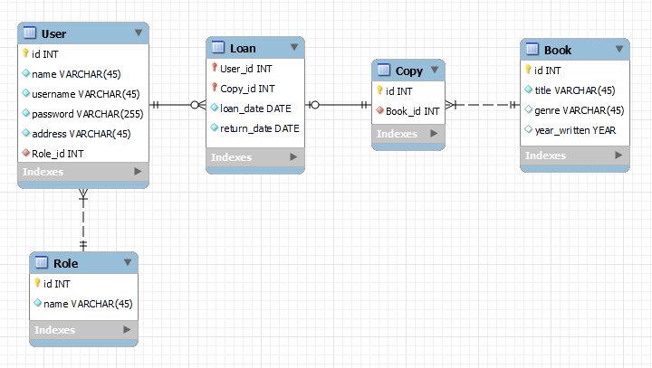

# CBD Project - Library Management System

## Overview
This is a microservices-based Library Management System that provides a scalable and maintainable solution for managing books, users, and library operations. The project is built using Jakarta EE, Spring Data JPA, and follows microservices architecture principles.

## Project Structure
The project consists of the following microservices:

- **API Gateway**: Entry point for all client requests, handles routing and load balancing
- **Config Server**: Centralized configuration management for all microservices
- **Eureka Server**: Service discovery and registration server
- **Book Service**: Manages book-related operations and inventory
- **User Service**: Handles user management and authentication
- **Library Service**: Manages library operations like borrowing and returning books

## Technology Stack
- Java 21
- Jakarta EE
- Spring Data JPA
- Spring Cloud (Eureka, Config Server)
- Lombok
- RESTful APIs

## Prerequisites
- JDK 21
- Maven
- Docker (optional)

## Getting Started

### Running the Application (Locally with Maven)

1. Start the Config Server:
```bash
cd config-server
mvn spring-boot:run
``` 

2. Start the Eureka Server:
```bash
cd eureka-server
mvn spring-boot:run
``` 

3. Start the core services:
```bash
cd book-service
mvn spring-boot:run

cd user-service
mvn spring-boot:run

cd library-service
mvn spring-boot:run
``` 

4. Start the API Gateway:
```bash
cd api-gateway
mvn spring-boot:run
``` 

The application will be accessible at `http://localhost:8765` (API Gateway endpoint)

### Running with Docker
If you prefer using Docker, you can pull prebuilt images from Docker Hub:
#### Docker Images:
- Eureka Server: [`aleksandarhorvat/eureka-server`](https://hub.docker.com/r/aleksandarhorvat/eureka-server)
- User Service: [`aleksandarhorvat/user-service`](https://hub.docker.com/r/aleksandarhorvat/user-service)
- Book Service: [`aleksandarhorvat/book-service`](https://hub.docker.com/r/aleksandarhorvat/book-service)
- Library Service: [`aleksandarhorvat/library-service`](https://hub.docker.com/r/aleksandarhorvat/library-service)
- API Gateway: [`aleksandarhorvat/api-gateway`](https://hub.docker.com/r/aleksandarhorvat/api-gateway)
#### Steps:
1. Make sure Docker is installed and running.
2. Navigate to the `resources` folder where the `docker-compose.yml` file is located.
3. Start all services using:
```bash
docker compose up
```
4. To stop the running containers:
```bash
docker compose down
```

## Service Endpoints

### API Gateway
- Base URL: `http://localhost:8765`

### Eureka Server
- Dashboard: `http://localhost:8761`

### Individual Services
- User Service: `http://localhost:8000`
- Book Service: `http://localhost:8001`
- Library Service: `http://localhost:8002`

## API Gateway Security

The API Gateway uses an API key-based authentication mechanism. All requests (except registration and login) **must include an `x-api-key` HTTP header**.

### API Keys
| Role  | API Key       |
|-------|----------------|
| USER  | `userKey123`   |
| ADMIN | `adminKey123`  |

### Open Endpoints (no API key required)
- `POST /users/register`
- `POST /users/login`

### Protected Endpoints

> The following routes **require the `x-api-key` header**:

#### Admin-only access (`x-api-key: adminKey123`)
- `/users/admin/**`
- `/library/admin/**`
- `/books/**`

#### User or Admin access (`x-api-key: userKey123` or `adminKey123`)
- `/users/**` (excluding `/register` and `/login`)
- `/library/**` (excluding `/admin/**`)

### Denied Endpoints
Any other endpoints not listed above will be denied with a `403 Forbidden` response.

## Features
- Centralized configuration management
- Service discovery and registration
- Load balancing
- Book management
- User management
- Library operations management

## Database Model



## Database Setup

To set up the initial data in the database, add the following rows to the `role` table:

- **Row 1**
    - `id`: 1
    - `name`: ADMIN

- **Row 2**
    - `id`: 2
    - `name`: USER
